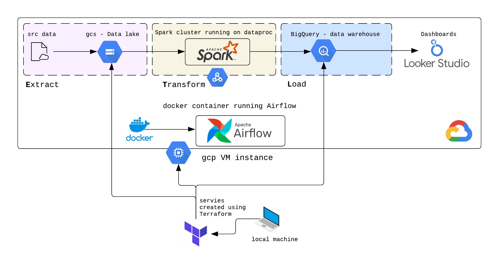
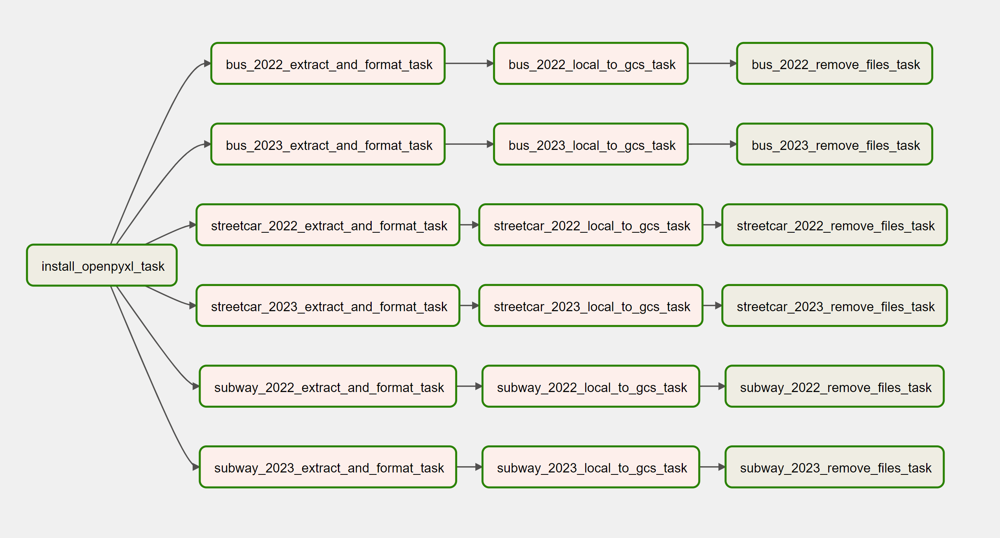
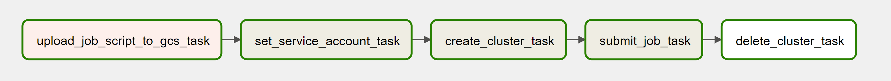
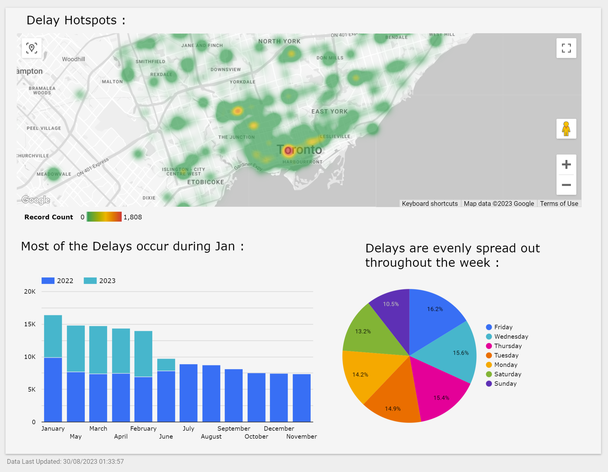
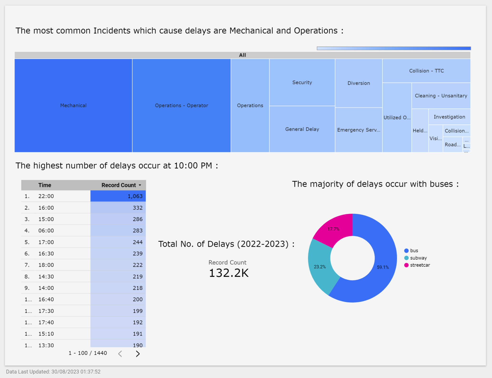

# TTC Delay Analytics

Analyzing Toronto public transit delay data to identify delay hotspots, root causes, and find valuable insights by creating an ETL (Extract, Transform, Load) pipeline and using Looker Studio to create dashboards.

## Source data

Data source - TTC bus, subway. streetcar delay data : [Open Data Catalogue - City of Toronto Open Data Portal](https://open.toronto.ca/catalogue/?search=ttc%20delay%20data&sort=score%20desc)

### Understanding the source data

**1. Subway**

|Field Name|Description|Example|
|---|---|---|
|Date|Date (YYYY/MM/DD)|12/31/2016|
|Time|Time (24h clock)|1:59|
|Day|Name of the day of the week|Saturday|
|Station|TTC subway station name|Rosedale Station|
|Code|TTC delay code|MUIS|
|Min Delay|Delay (in minutes) to subway service|5|
|Min Gap|Time length (in minutes) between trains|9|
|Bound|Direction of train dependant on the line|N|
|Line|TTC subway line i.e. YU, BD, SHP, and SRT|YU|
|Vehicle|TTC train number|5961|

**2. Bus & Streetcar**

|Field Name|Description|Example|
|---|---|---|
|Report Date|The date (YYYY/MM/DD) when the delay-causing incident occurred|6/20/2017|
|Route|The number of the bus route|51|
|Time|The time (hh:mm:ss AM/PM) when the delay-causing incident occurred|12:35:00 AM|
|Day|The name of the day|Monday|
|Location|The location of the delay-causing incident|York Mills Station|
|Incident|The description of the delay-causing incident|Mechanical|
|Min Delay|The delay, in minutes, to the schedule for the following bus|10|
|Min Gap|The total scheduled time, in minutes, from the bus ahead of the following bus|20|
|Direction|The direction of the bus route where B,b or BW indicates both ways.  (On an east-west route, it includes both east and west) NB - northbound, SB - southbound, EB - eastbound, WB - westbound|N||
|Vehicle|Vehicle number|1057|

## Infrastructure

- Used **Terraform** to set up the infrastructure 
- used a google cloud **VM instance** to run everything
- Used **GCS** (google cloud storage) as our data lake and **BigQuery** as our data warehouse
- Used use **Spark** to process, transform and clean the data
- Used **Docker** to run Airflow inside the VM
- Used **Airflow** to automate this entire process and run it at scheduled intervals to keep the data up to date.

Terraform will be run on the local setup to setup up the VM instance on google cloud platform which will then be be used to perform all 3 tasks (Extract, Transform, Load)

> [!NOTE]
> Data is processed in batches using spark (scheduled yearly using Airflow)  
> Can also be increased to every month but that is not cost-effective

**Airflow DAGs (Directed Acyclic Graphs)**

1. [src_to_gcs_dag.py](Airflow/dags/src_to_gcs_dag.py)
downloads data from the Toronto open portal website, converts it to parquet form, loads it into gcs bucket and removes it from the VM's local file system once it is available on the cloud.

2. [dataproc_job_dag.py](Airflow/dags/dataproc_job_dag.py) uploads the main python file [spark_job.py](Airflow/dags/spark_job.py) for running the spark job to the gcs bucket (so dataproc can fetch it), set the service account which authorizes the airflow container to work with gcp services, create a cluster, run the job and then delete it to avoid idle running costs.

## Dashboard

[looker studio dashboard ↗](https://lookerstudio.google.com/reporting/c2f8e496-b46b-4f07-8025-635abf038a21)

There are no delay records for July - December 2023 as this image was taken in August 2023 

